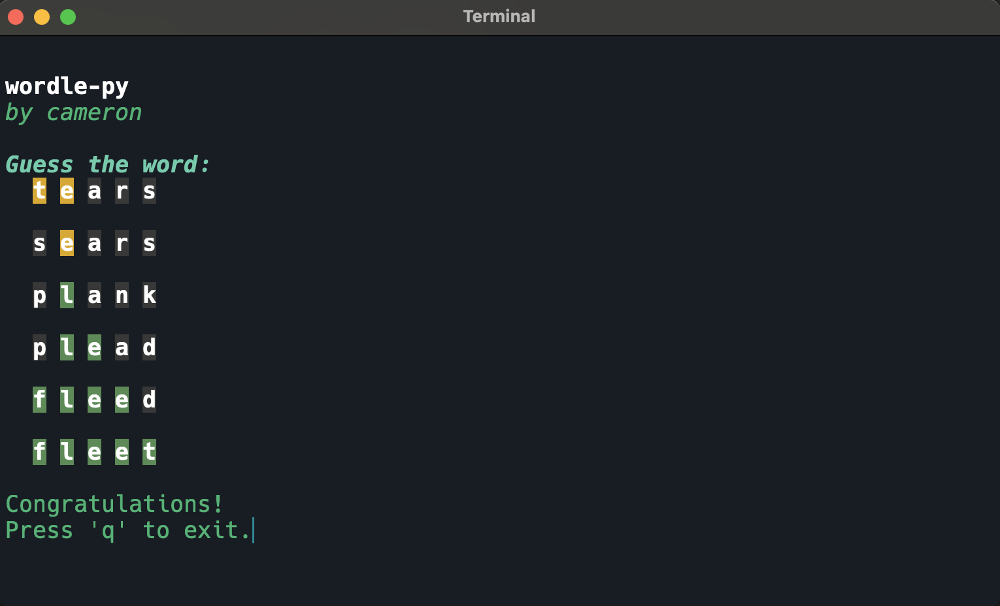

# wordle-py
Wordle clone written in python.

This program is a terminal based implementation of the New York Times game, [Wordle](https://www.nytimes.com/games/wordle/), written in Python.

The user has 6 guesses to guess the word. After each guess the program will display the letters in the word that are correct, incorrect, or in the wrong position.
- Green letter: correct letter in the correct position
- Yellow letter: correct letter in the wrong position
- Gray letter: incorrect letter




## Installation
1. Clone the repository
```bash
git clone https://github.com/wzid/wordle-py.git
```
2. Change directory to the repository
```bash
cd wordle-py
```
3. Install the required packages
```bash
pip install -r requirements.txt
```
4. Run the program
```bash
python main.py
```

## Implementation

This program uses a list of 3103 five-letter words and chooses a new word based on the number of days between the current date and April 8th, 2024.

I am using the `blessed` tui library to create the terminal interface.